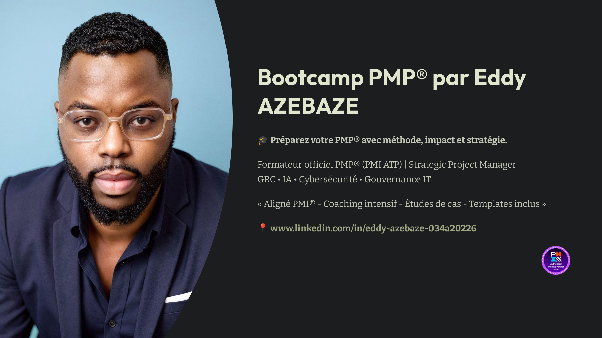

# PMP Bootcamp by Eddy

  

Bootcamp intensif pour décrocher la certification **PMP®** avec méthode, impact et stratégie.  
Conçu et animé par **Eddy Azebaze**, formateur officiel PMP (PMI ATP), expert en gestion de projet stratégique, GRC, cybersécurité et IA responsable.

---

## Objectifs du Bootcamp

- Préparer efficacement les chefs de projet à la certification PMP®  
- Renforcer la posture stratégique et opérationnelle des professionnels  
- Accompagner la montée en compétence dans des environnements critiques et réglementés  
- Ouvrir à des missions à fort impact (freelance, management de transition, consulting)

---

## Contenu du dépôt GitHub

| Dossier         | Description                                                       |
|----------------|-------------------------------------------------------------------|
| `00-overview`   | Objectifs pédagogiques et structure générale du Bootcamp          |
| `01-programme`  | Programme semaine par semaine : fondamentaux, cadrage, exécution, certification |
| `02-ressources` | Fiches outils, glossaire PMP®, templates essentiels               |

---

## Public visé

- Chefs de projet confirmés souhaitant décrocher la PMP®  
- Responsables IT, PMO, consultants et indépendants  
- Professionnels en reconversion vers la gestion de projet

---

## Ce qui rend ce bootcamp unique

- Aligné avec les standards **PMI®** (ATP compliant)  
- Intégration d'études de cas réels et de schémas directeurs IT  
- Support visuel, coaching individuel, pédagogie active  
- Bonus : ressources GRC, IA, cybersécurité pour projets critiques

---

## Pour aller plus loin

- Profil LinkedIn : [www.linkedin.com/in/eddy-azebaze-034a20226](https://www.linkedin.com/in/eddy-azebaze-034a20226)  
- Contact : edazebz[at]proton.me

---

**Ce dépôt sera enrichi en continu. N’hésitez pas à le suivre ou le partager.**

> “Deliver what matters. Measure what counts.” - Project Leadership by Design.
